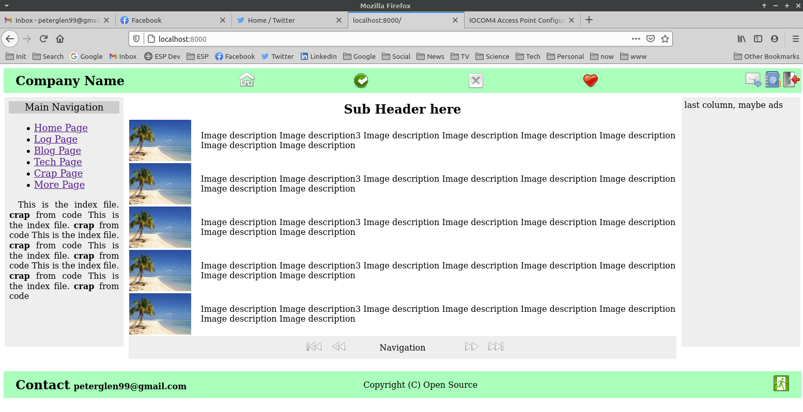

# Wsgi Web Server

## WSGI compliant web server, initial steps.

 Mon 27.Sep.2021 first steps are successful.

 Web server with no dependencies (for security). One might say this is a framework-less framework.

 What works:

   * First page delivered
   * Dynamic page gen
   * Template expansion { vars } are substituted recursively
   * connected to apache2 (tests OK)
   * image re-size from { vars } arguments ex: { image any.png 800 }

 On the screen shot below, images are added, images are dynamically re sized with the PIL
 library;

  

 On the screen shot below, projects is added in a separate directory; The project is isolated,
 errors in the project do not influence the site; only an error message shows.

  

  Variable subst regex: "{ .*? }"  (example: { header } )
  Command parameter subst regex: "\[ .*? \]"  (example: [ value_one ] )

  See index.html for examples.

    Files:
        _global for url to function mapping
        _content for stuff
        _globals for static stuff and { var }  definitions

   Directories:
        projects for application projects
        siteicons for icons
        media for image content

 Flow of presenting:

    url lookup in main ->
        if entry present
            if html file exists:
                expand macro -> present page
            else
                call function in url table
                function fills in everything -> present
        else
            if static file ->
                present it
            else
                if 404 file
                    present it
                else
                    404 message

 To create a new project:

    Add a directory to the web server content directory
        that starts with 'proj' (like proj-hello or proj-sales)
    fill in the directory with content
        o Initial .py file to configure the project (any name)
        o Content that responds to the callbacks, or presented as is

    See proj-index for an example hoem page. Also proj* for more
    detailed examples. Please note how simple a calendar
    implementation becomes.

### History:

    Fri 16.Apr.2021 Skeleton project
    Sun 18.Apr.2021 Apache tests OK
    Mon 19.Apr.2021 Turned icons/ to siteicons/ (for apache not to redirect)
    Thu 22.Apr.2021 Projects in separate dir, reverse isolation
    Mon 27.Sep.2021 Moved user contents to the subdir 'content' (more isolation)
    Mon Tue 28.Sep.2021 Cleanup, first useful site

## Licence

 Open source.

 PG