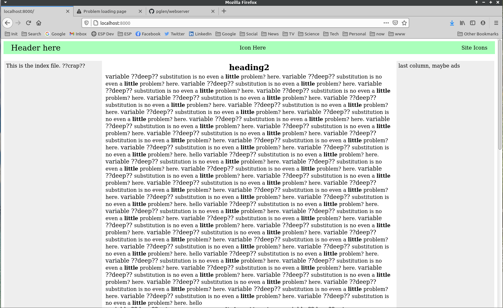
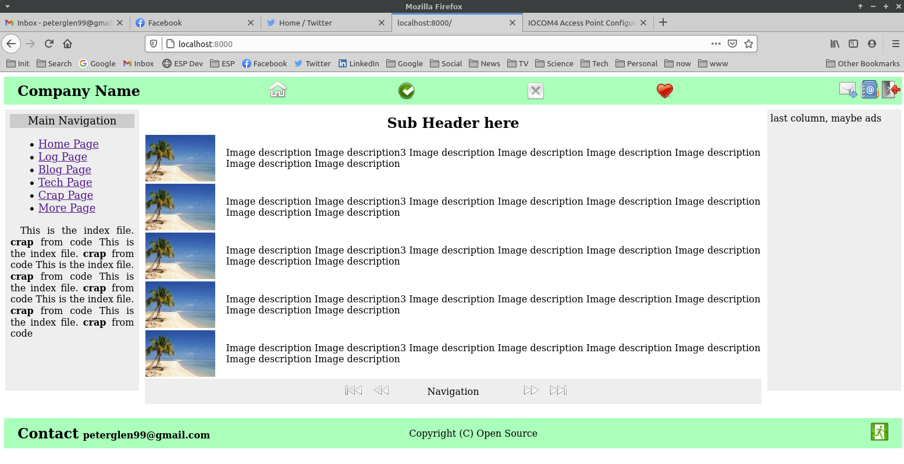

# wsgi webserver

## WSGI compliant web server, initial steps.

 Nothing useful, but first steps are successful.

 Web server with no dependencies (for security). One might say this is a framework-less framework.

 What works:

   * First page delivered
   * Dynamic page gen
   * Template expansion { vars } are substituted recursively
   * connected to apache2 (tests OK)
   * image re-size from { vars } arguments ex: { image any.png 800 }

 

 On the screen shot above, the recursive substitution is shown, including
 an undefined variable; (surrounded by question marks)

 On the screen shot below, images are added, images are dynamically resized with the PIL
 library;

  

  Variable subst regex: "{ .*? }"  (example: { header } )

    Files:
        _global for url to function mapping
        _content for stuff
        _globals for static stuff and { var }  definitions

 Open source.

 PG