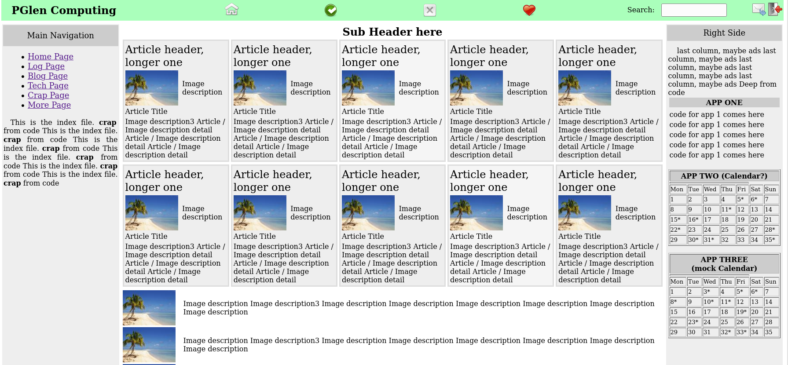

# wsgi webserver

## WSGI compliant web server, initial steps.

 Nothing useful, but first steps are successful.

 Web server with no dependencies (for security). One might say this is a framework-less framework.

 What works:

   * First page delivered
   * Dynamic page gen
   * Template expansion { vars } are substituted recursively
   * connected to apache2 (tests OK)
   * image re-size from { vars } arguments ex: { image any.png 800 }

 

 On the screen shot above, the recursive substitution is shown, including
 an undefined variable; (surrounded by question marks)

 On the screen shot below, images are added, images are dynamically re sized with the PIL
 library;

  

 On the screen shot below, projects is added in a separate directory; The project is isolated,
 errors in the project do not influence the site; only an error message shows.

  

  Variable subst regex: "{ .*? }"  (example: { header } )
  Command parameter subst regex: "\[ .*? \]"  (example: [ value_one ] )

  See index.html for examples.

    Files:
        _global for url to function mapping
        _content for stuff
        _globals for static stuff and { var }  definitions

 Flow of presenting:

    url lookup in main ->
        if entry present
            if html file exists:
                expand macro -> present page
            else
                call function in url table
                function fills in everything -> present
        else
            if static file ->
                present it
            else
                if 404 file
                    present it
                else
                    404 message

### History:

    Fri 16.Apr.2021 Skeleton project
    Sun 18.Apr.2021 Apache tests OK
    Mon 19.Apr.2021 turned icons/ to siteicons/ (for apache not to redirect)
    Thu 22.Apr.2021 projects in separate dir, reverse isolation

 Open source.

 PG